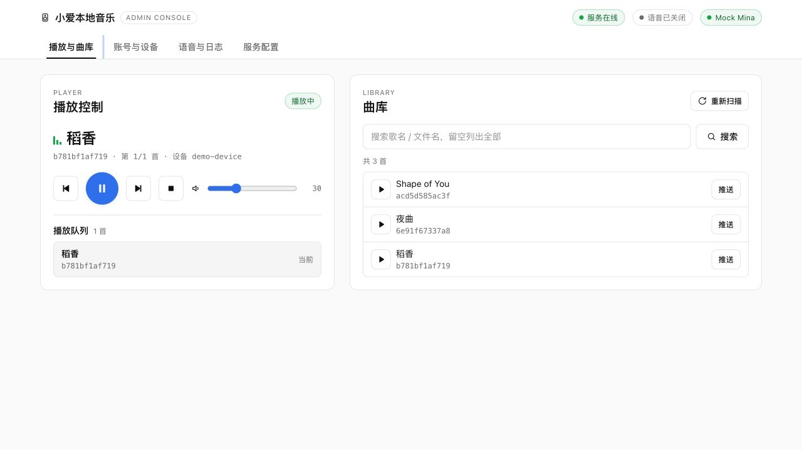
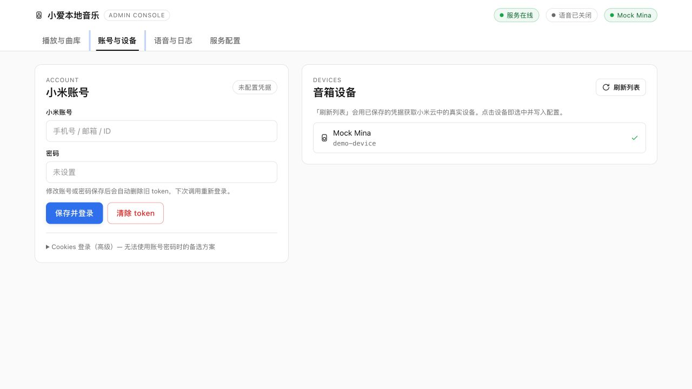
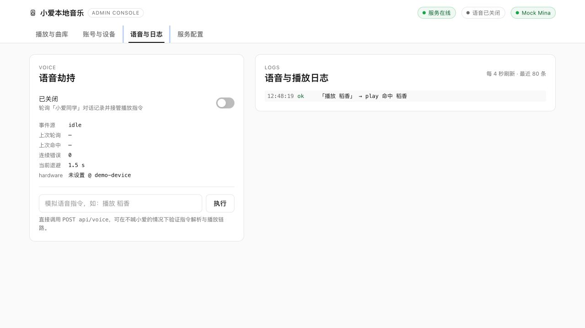

# xiaoai-local-music

面向 NAS 的小爱本地音乐桥接服务：扫描本地音频文件，通过网页和 HTTP API 控制小米音箱播放。

## 简介

项目把 NAS 上的本地曲库转换为小爱音箱可以访问的媒体 URL，并通过 [MiService](https://github.com/Yonsm/MiService) 调用小米 MiNA 服务完成设备发现、播放和控制。它适合在家庭局域网或可信内网中运行，不需要把音频文件上传到第三方音乐平台。

- 解决的问题：让小爱音箱播放 NAS 上的本地音频，并提供可脚本化的控制接口。
- 目标用户：拥有 NAS/家庭服务器和小米音箱、需要局域网音乐播放的用户。
- 核心价值：只读扫描曲库、真实 MiNA 设备控制、网页管理台与 API 并用。

## 功能特性

- 扫描 `.mp3`、`.flac`、`.m4a`、`.wav` 文件，按文件名生成曲目标题和稳定 ID。
- 提供曲目搜索、媒体文件访问、可持久化命名歌单、播放队列、播放/暂停/继续/上一首/下一首/停止/音量控制。
- 支持账号密码登录、SMS/Email OTP 验证，以及粘贴 `userId`/`serviceToken` 的 Cookies 登录。
- 可选启用小爱对话轮询，识别中文播放和控制指令；支持播放确认播报、错误退避和环形日志。
- 配置通过 YAML 和环境变量管理，敏感 token 以 600 权限保存到配置目录。

## 截图

### 播放与曲库



### 账号与设备



### 语音与日志



## 安装

### 环境要求

- Python 3.10+（Docker 镜像基于 Python 3.12）。
- Docker Engine 与 Docker Compose（使用容器部署时）。
- 一个可读的本地曲库目录，以及音箱能够访问的 HTTP(S) 地址。
- 小米账号凭据或有效的 MiNA `.mi.token`；也可以在管理台登录后再配置。

### 安装步骤

本地运行：

```bash
python3 -m venv .venv
source .venv/bin/activate
pip install -r requirements.txt
cp config/config.yaml.example config/config.yaml
export PUBLIC_BASE_URL=http://<NAS或主机地址>:8123
python -m app.main
```

Docker Compose：

```bash
cp compose.yml.example compose.yml
export MUSIC_HOST_DIR=/path/to/music
export CONFIG_HOST_DIR=$PWD/config
export PUBLIC_BASE_URL=http://<NAS或主机地址>:8123
docker compose up -d
```

`MUSIC_HOST_DIR` 以只读方式挂载到容器 `/music`，`CONFIG_HOST_DIR` 挂载到 `/config`。配置目录需要可写，以便保存 `.mi.token` 和通过管理台更新的配置。

## 快速开始

```bash
# 本地运行时
export PUBLIC_BASE_URL=http://<音箱可访问的地址>:8123
python -m app.main

# 容器运行时
docker compose up -d
```

启动后访问 `http://<主机地址>:8123/`，即可看到管理台。首次使用建议按以下顺序操作：

- 在“账号与设备”中填写小米账号密码并登录，按页面提示提交 OTP；或粘贴有效的 Cookies / `.mi.token` JSON。
- 在“音箱设备”中选择目标设备；未配置设备时，`GET /api/devices` 会尝试选中账号下第一台设备。
- 确认 `public_base_url` 是音箱可直接访问的绝对 HTTP(S) 地址，再从曲目列表搜索并播放。
- 如启用语音轮询，先填写 `mina_device_id` 与 `voice.hardware`，再打开语音开关。

健康检查地址为 `/healthz`，正常时返回 `{"status":"ok"}`。

## 使用说明

### 基本用法

服务启动时扫描曲库并建立内存快照，当前版本不落盘保存索引，也不解析音频标签；曲目标题取自文件名。文件新增、删除或重命名后需要重启服务，管理台中的“重新扫描”按钮目前仅提示该限制，服务尚未提供 `/api/rescan` 接口。

播放时服务会把 `public_base_url/media/by-id/{track_id}` 交给 MiNA。媒体路由支持 `GET`、`HEAD` 和 HTTP Range；音箱和运行服务的主机必须能够互相访问该地址。

### 常用示例

#### 查询并播放曲目

```bash
BASE_URL=http://127.0.0.1:8123
curl "$BASE_URL/api/tracks?q=稻香"
curl -X POST "$BASE_URL/api/play" \
  -H 'content-type: application/json' \
  -d '{"track_id":"<曲目ID>","queue_ids":["<曲目ID>"]}'
```

#### 创建并播放歌单

歌单保存在 `config_dir/playlists.json`，服务重启后会自动恢复；若歌单文件损坏，启动时会自动备份为 `playlists.json.corrupt-*` 并以空歌单继续运行。曲库文件仍按启动时扫描的快照管理；若歌单引用的文件已被删除，播放时会返回缺失曲目错误。

```bash
PLAYLIST=$(curl -s -X POST "$BASE_URL/api/playlists" \
  -H 'content-type: application/json' \
  -d '{"name":"通勤","track_ids":["<曲目ID1>","<曲目ID2>"]}')
PLAYLIST_ID=$(printf '%s' "$PLAYLIST" | jq -r .id)
curl -X POST "$BASE_URL/api/playlists/$PLAYLIST_ID/play" \
  -H 'content-type: application/json' \
  -d '{"mode":"sequential"}'
```

歌单播放模式为 `sequential`（顺序播放到末尾停止）、`list_loop`（列表循环）和 `single_loop`（循环当前曲目）。曲库页面的“推送”按钮只播放当前单曲一次；语音播放同样只播放命中的一首并在结束后停止。

#### 查看设备和队列

```bash
curl "$BASE_URL/api/devices"
curl "$BASE_URL/api/queue"
curl -X POST "$BASE_URL/api/next"
curl -X POST "$BASE_URL/api/volume" \
  -H 'content-type: application/json' \
  -d '{"volume":35}'
```

#### 测试语音指令

```bash
curl -X POST "$BASE_URL/api/voice" \
  -H 'content-type: application/json' \
  -d '{"text":"播放 稻香"}'
curl "$BASE_URL/api/voice/status"
curl "$BASE_URL/api/logs?limit=20"
```

`/api/voice` 支持“播放/我要听/来一首”等播放前缀，以及“暂停、继续、下一首、上一首、停止”等控制指令。关闭 `voice.hijack_all_play` 后，播放意图不会接管，但控制类指令仍可执行。

### API 概览

| 方法 | 路径 | 作用 |
| --- | --- | --- |
| `GET` | `/api/tracks?q=关键词` | 查询曲目 |
| `GET`/`HEAD` | `/media/by-id/{track_id}` | 获取音频文件，支持 Range |
| `POST` | `/api/play` | 播放曲目，可传 `queue_ids` 与 `mode`（缺省：单曲 `once`、多曲 `sequential`） |
| `GET`、`POST` | `/api/playlists` | 列出或创建命名歌单 |
| `GET`、`PUT`、`DELETE` | `/api/playlists/{playlist_id}` | 查看、编辑或删除歌单 |
| `POST` | `/api/playlists/{playlist_id}/play` | 按模式播放歌单 |
| `POST` | `/api/pause`、`/api/resume`、`/api/stop`、`/api/next`、`/api/previous` | 播放控制 |
| `POST` | `/api/volume` | 设置 0–100 的音量 |
| `GET` | `/api/devices`、`/api/queue` | 查看设备、队列、播放模式与探测状态 |
| `GET`/`PUT` | `/api/config` | 读取或更新配置；密码读取时脱敏 |
| `POST` | `/api/login`、`/api/login/otp`、`/api/login/cookies` | 账号/OTP/Cookies 登录 |
| `GET` | `/api/login/status`、`/api/voice/status`、`/api/logs` | 查看登录、语音和日志状态 |
| `POST` | `/api/voice`、`/api/voice/enable`、`/api/token/clear` | 手动执行语音指令、启停语音、清除 token |

## 配置说明

### 环境变量

环境变量优先于 YAML；空字符串不会覆盖已有配置。`MUSIC_DIR` 是兼容旧配置的别名，`MUSIC_ROOT` 优先级更高。

| 变量名 | 说明 | 默认值 |
| --- | --- | --- |
| `CONFIG_DIR` | 配置文件和 `.mi.token` 所在目录 | `/config` |
| `MUSIC_ROOT` | 容器或本机曲库目录 | `/music` |
| `MUSIC_DIR` | `MUSIC_ROOT` 的兼容别名 | 无 |
| `PUBLIC_BASE_URL` | 音箱可访问的绝对 HTTP(S) 地址 | 必填 |
| `HOST` | 监听地址 | `0.0.0.0` |
| `PORT` | 监听端口 | `8123` |
| `XIAOMI_USER` | 小米账号 | 无 |
| `XIAOMI_PASSWORD` | 小米账号密码 | 无 |
| `MINA_DEVICE_ID` | 默认音箱设备 ID | 无 |
| `VOICE_ENABLED` | 是否启用语音轮询 | `false` |
| `VOICE_POLL_INTERVAL_SEC` | 轮询间隔（秒） | `1.5` |
| `VOICE_HIJACK_ALL_PLAY` | 是否接管播放意图 | `true` |
| `VOICE_SPEAK_CONFIRM` | 播放前是否让音箱播报确认 | `true` |
| `VOICE_HARDWARE` | 音箱硬件型号；启用语音时必填 | `""` |

### 配置文件

复制 `config/config.yaml.example` 为 `config/config.yaml` 后按需修改：

```yaml
xiaomi_user: "your-xiaomi-user"
xiaomi_password: "your-xiaomi-password"
mina_device_id: null
public_base_url: "http://nas-host:8123"
music_root: "/music"
host: "0.0.0.0"
port: 8123
voice:
  enabled: false
  poll_interval_sec: 1.5
  hijack_all_play: true
  speak_confirm: true
  hardware: "LX06"
```

`public_base_url`、`music_root`、`host`、`port` 的运行时修改会返回 `restart_required: true`，需要重启服务才会应用。账号密码修改会使旧 token 失效；登录成功后的 token 保存为 `/config/.mi.token`，文件权限为 600。

## 项目结构

```text
.
├── app/
│   ├── main.py              # FastAPI 应用与 lifespan
│   ├── config.py            # YAML/环境变量配置
│   ├── routes.py            # 网页、登录、曲目、播放与配置 API
│   ├── service.py           # 曲库扫描、内存索引与播放队列
│   ├── mina_client.py       # MiService MiNA 适配器
│   ├── cookie_login.py      # Cookie/.mi.token 解析与安全写入
│   ├── voice.py             # 中文指令解析
│   ├── voice_worker.py      # 对话轮询、派发、退避与日志
│   └── static/index.html    # 单页管理台
├── config/config.yaml.example
├── compose.yml.example      # GHCR 镜像部署模板
├── Dockerfile
├── requirements.txt
├── tests/                   # API、配置、登录、播放和语音测试
└── LICENSE
```

## 开发指南

### 本地开发

```bash
python3 -m venv .venv
source .venv/bin/activate
pip install -r requirements.txt
export PUBLIC_BASE_URL=http://127.0.0.1:8123
python -m app.main
```

### 构建

```bash
docker build -t xiaoai-local-music:local .
```

若使用仓库中本机专用的 `compose.yml`（将服务配置为 `build: .`），再运行 `docker compose up -d --build`。

### 测试

```bash
.venv/bin/python -m pytest -q
```

### 代码规范

- 保持 API、配置字段和错误状态码与现有测试一致。
- 外部 MiNA 调用通过可注入的客户端或数据源隔离，避免在单元测试中依赖真实账号和设备。
- 不在日志、示例或测试输出中提交账号密码、Cookie、serviceToken、`.mi.token` 或真实局域网凭证。

## 常见问题

### 1. 服务启动失败，提示 `public_base_url` 或曲库目录错误怎么办？

`public_base_url` 必须是带主机名/IP 和端口的绝对 `http://` 或 `https://` 地址，且音箱能访问；`music_root` 必须存在并且是目录。启动阶段扫描失败会阻止服务启动，请先检查挂载路径和权限。

### 2. 端口被占用怎么办？

修改 `PORT` 或 YAML 中的 `port`，并同步修改 Docker Compose 的端口映射。例如使用 `PORT=18123` 时，把宿主机映射改为 `18123:18123`，同时更新 `PUBLIC_BASE_URL`。

### 3. 登录成功但无法播放怎么办？

先调用 `/api/devices` 确认账号能列出设备并选择正确的 `mina_device_id`，再确认音箱能访问曲目响应中的 `path` URL。Cookies 登录需要同时提供 `userId` 和 `serviceToken`；serviceToken 过期后要重新获取。

### 4. 新增歌曲为什么没有出现在列表里？

曲库索引只在启动时建立并缓存在内存中，当前没有可用的重扫 API。新增、删除或重命名文件后请重启服务；仅修改音频标签也不会改变标题，因为标题取自文件名。

## 安全提示

服务默认没有 Web 认证和限流，请只在可信内网使用，不要直接暴露到公网。`public_base_url`、小米账号、Cookie、`serviceToken` 和 `.mi.token` 都属于敏感信息；配置目录应限制为服务用户可读，日志和截图也不要包含这些内容。

## 许可证

[MIT License](./LICENSE)
